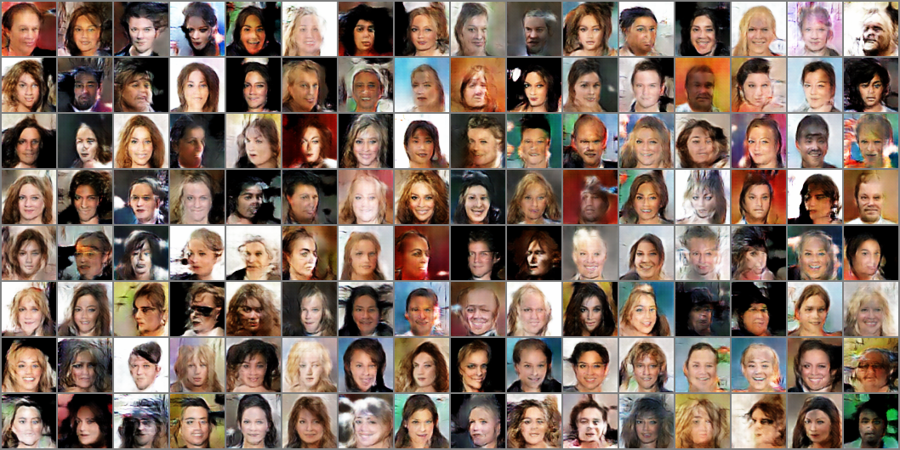
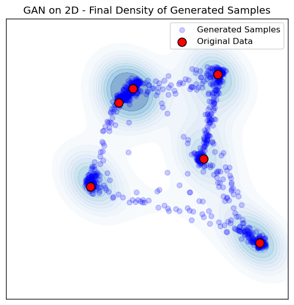
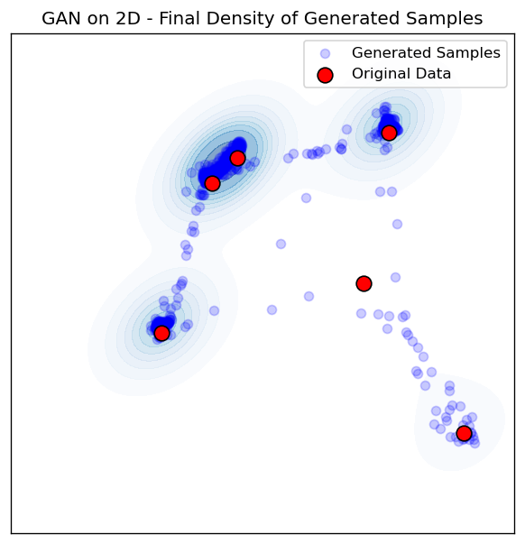
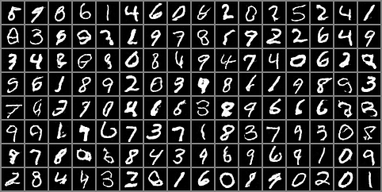
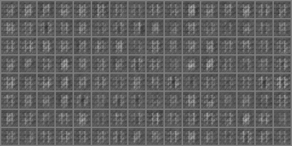

# Sliced-Wasserstein-GAN
An implementation of the sliced wasserstein distance for generative training with SGD optimizer.

<p align="center">
  
</p>

## Overview

This repository provides an implementation of the sliced Wasserstein distance for generative training (Sliced-Wasserstein-GAN). You will find three Jupyter notebooks that demonstrate how to train and evaluate models on:
1. **2D Synthetic Dataset**
2. **MNIST**
3. **CelebA**

---

## Notebooks

1. **`swgan2D.ipynb`**  
   Illustrates how to train a GAN/WGAN on a 2D synthetic dataset (e.g., Gaussian mixtures).

2. **`swganMNIST.ipynb`**  
   Shows how to train a GAN/WGAN on the MNIST handwritten digit dataset.

3. **`swganCeleba.ipynb`**  
   Demonstrates how to train a GAN/WGAN on the CelebA dataset.  

---

## CelebA Dataset

For training on CelebA, you must download the dataset from Kaggle. You can either:
- Download it manually from [Kaggle Datasets: jessicali9530/celeba-dataset](https://www.kaggle.com/datasets/jessicali9530/celeba-dataset) and place the extracted images in the **root directory** of this repository, **OR**
- Use the snippet below (in Python) to download directly via `kagglehub`:

```python
import kagglehub

# Download the latest version to the current directory
path = kagglehub.dataset_download("jessicali9530/celeba-dataset", path=".")

print("Path to dataset files:", path)
```

Make sure that your folder structure looks like this once the CelebA data is in place:

```
Sliced-Wasserstein-GAN/
├── swgan2D.ipynb
├── swganMNIST.ipynb
├── swganCeleba.ipynb
├── figures/
└── img_align_celeba/  <-- contains CelebA images
```

---

## Training & Usage

1. **2D Synthetic Dataset**  
   - Run `SWGAN_2D.ipynb` to train a WGAN using sliced Wasserstein distance (or compare to standard GAN).
   - Modify hyperparameters like batch size, learning rate, etc., in the notebook as you wish.

2. **MNIST**  
   - Run `SWGAN_MNIST.ipynb` to train on MNIST.  
   - The notebook will automatically download MNIST if you do not have it locally.

3. **CelebA**  
   - Confirm you have the dataset in the correct folder.  
   - Run `SWGAN_Celeba.ipynb` to start training a WGAN or standard GAN on the CelebA images.

---

## Results & Comparison

### WGAN vs. GAN on 2D Synthetic Data

<table>
  <tr>
    <td align="center"><strong>WGAN (2D, ADAM)</strong></td>
    <td align="center"><strong>GAN (2D, ADAM)</strong></td>
  </tr>
  <tr>
    <td></td>
    <td></td>
  </tr>
</table>

### WGAN vs. GAN on MNIST

<table>
  <tr>
    <td align="center"><strong>WGAN (MNIST, ADAM)</strong></td>
    <td align="center"><strong>GAN (MNIST, ADAM)</strong></td>
  </tr>
  <tr>
    <td></td>
    <td></td>
  </tr>
</table>

> **Note**: You can also compare the optimizer effects (ADAM vs. SGD, etc.) by inspecting the corresponding figures in the `figures/` folder.

